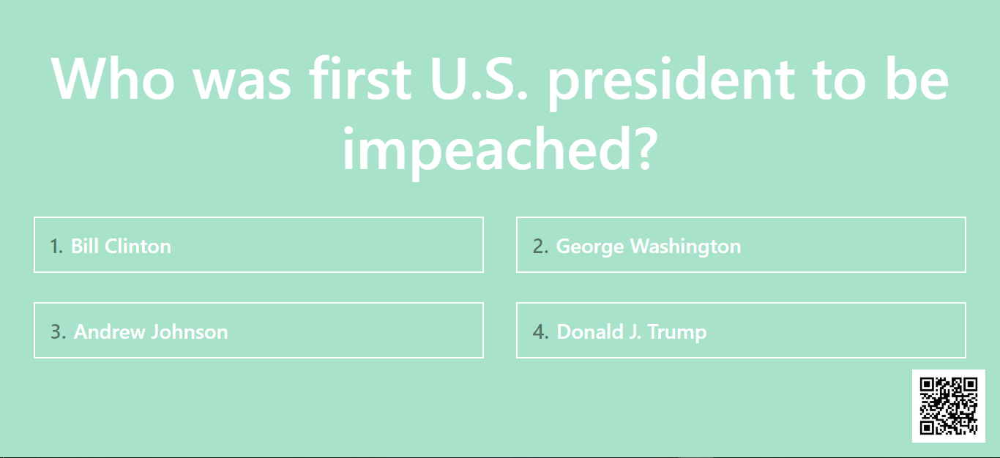
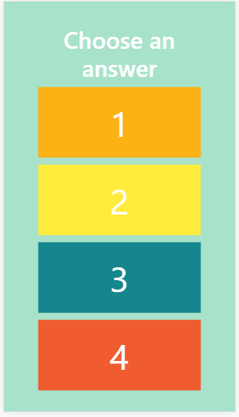

# IQueue
A fun trivia game for people who stands in line

* Giti Vebber
* Tali Badichi
* Chani Glick

IQueue is a realy fun game that intended to be presents on signage. Whenever our signage is placed, nearby a queue, everyone who stant in line, boring and sad, can scan a qr-codes which presents on the signage and join the perfect trivia game ever!!! 

## Screenshots

## How to Run This Game

### Prerequisites
* Python 3.7 
* Django

### Setup
* Clone this repo from github

### Run

To run this project use:

    python manage.py runserver

